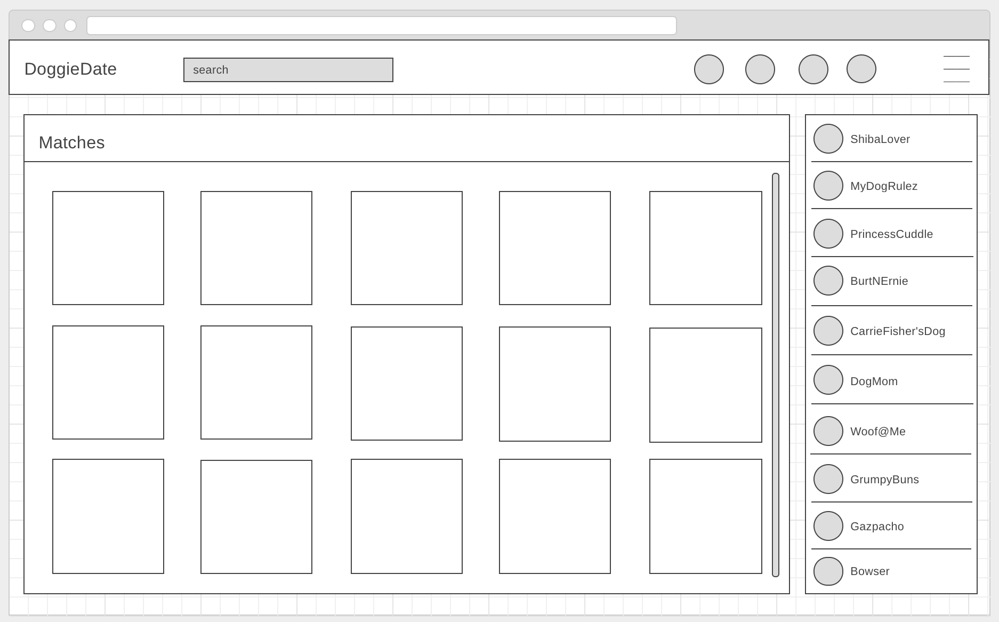

# DoggieDate
Matt Bedell & Aaron Conklin

## Concept
DoggieDate is a full stack web application for dog owners who are looking to meet other dog owners for dog playdates, people dates, meetups/events, or increase their dog's visibility.

## User Story

This app is for the dog owner who understands the importance of socializing their dog. However, this can be challenging if they happen to be new to a city, are travelling, are cautious of the temperment, size, energy level (etc.) of the dogs they are familiar with, or are just unfamiliar with who is available. The user can now use the 'Nearby' grid do their research about the compatibility of the potential play date and avoid some dangerous circumstances...

The user can also simply use the 'Global' view to fill their day with adorable pups and try to make their baby an internet sensation. When you add your pup's picture to the site, anyone can see and 'Like' it. Watch their popularity soar!

When a user is interested in chatting, they click to match with that profile. If the requestee approves, then chat capability is available. You can now coordinate a DoggieDate.

## Technologies

The application has a node/express.js back end and a React front end. 

The database is PSQL.

Supplemental technologies include: React Dropzone, webpack, AWS, JSON Web Token, ZipCodeAPI, and more to come...

## Wireframe

## Future Goals

React Native
Deployment
Marketing
Social Media Presence

### Technologies Used: 
- [x] REACT
- [x] NODE.JS
- [x] EXPRESS.JS
- [x] PSQL
- [x] CSS 
- [x] WEBPACK
- [x] JSON WEB TOKEN
- [ ] REACT DROPZONE
- [ ] AWS
- [ ] ZipCodeAPI
- [ ] REACT REDUX

